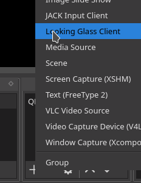
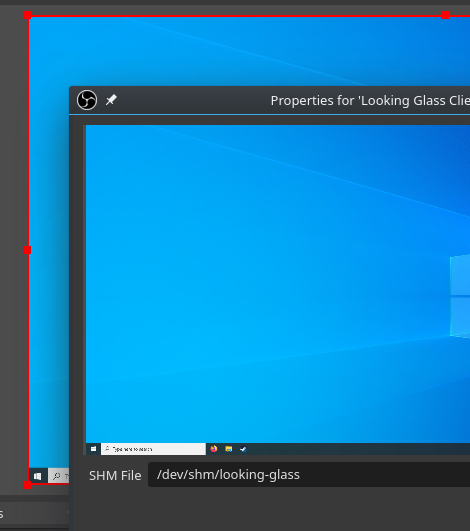

OBS plugin
##########

You can add a Looking Glass video feed
to OBS as a video source with the included OBS plugin. This provides a
lower-latency alternative to capturing the Looking Glass client window
with a Screen or Window Capture source.

This may help improve your viewers' watching experience, and
allows you to use your host privately.

Build Instructions
~~~~~~~~~~~~~~~~~~

The OBS plugin is included in the main source tree of Looking Glass. The
building process is very similar to the
:ref:`client's <build_client_section>`.

Dependencies
^^^^^^^^^^^^

The OBS plugin requires the following extra dependencies alongside the
:ref:`client's build
dependencies <installing_build_dependencies>`.

-  libobs-dev

Install this package with ``apt-get``

.. code:: bash

   apt-get install libobs-dev

.. _obs_building:

Building
^^^^^^^^

These instructions are similar to building the
:ref:`client <client_building>`.

.. code:: bash

   mkdir obs/build
   cd obs/build
   cmake -DUSER_INSTALL=1 ../
   make

Alternatively, if you would like to install the plugin for all users:

.. code:: bash

   mkdir obs/build
   cd obs/build
   cmake ../
   make

Installation
~~~~~~~~~~~~

You can install the plugin by running ``make install``.

.. code:: bash

   make install

If you've opted to install the plugin for all users, you will need to run
this command as ``root``.

.. code:: bash

   sudo make install

Setup
~~~~~

Once installed, you can select the *"Looking Glass Client"* source from
the OBS sources menu. Configuration requires the IVSHMEM file
used by the VM, and this is pre-populated with the default
filename for Looking Glass.

.. _open_broadcaster_software:

Open Broadcaster Software
~~~~~~~~~~~~~~~~~~~~~~~~~

The plugin is made for OBS, an open source streaming and recording
studio. Find out more at https://obsproject.com/

OBS is available under most distributions as *obs-studio* or just *obs*.

Screenshots
~~~~~~~~~~~

   Adding the plugin as a video source

   Plugin configuration settings
