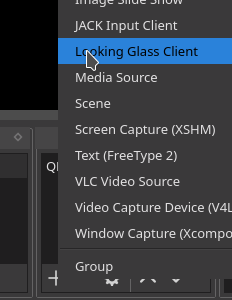

.. _obs_plugin:
.. _open_broadcaster_software:

OBS plugin
##########

The Looking Glass OBS plugin reads video from LGMP directly instead of
capturing the client window. The client can stay hidden or show overlays
without adding them to the OBS source. This source does not provide audio or
input; add the required audio source separately in OBS.

Use an OBS plugin from the same Looking Glass release as the IDD and client.
The shared-memory protocol is versioned and mismatched components will not
connect.

.. _obs_building:

Build and install
-----------------

On Debian-based systems, install the OBS headers and the small set of build
dependencies used by the plugin:

.. code:: bash

   apt-get install cmake gcc libobs-dev libdw-dev libunwind-dev make pkg-config

Use ``-DENABLE_BACKTRACE=no`` when configuring if ``libdw-dev`` and
``libunwind-dev`` are intentionally omitted.

From the Looking Glass source directory, build the plugin for the current
user:

.. code:: bash

   mkdir -p obs/build
   cd obs/build
   cmake -DUSER_INSTALL=1 ../
   make
   make install

For a system-wide installation, omit ``-DUSER_INSTALL=1`` and run
``sudo make install``.

Add the source
--------------

1. Start OBS after installing the plugin.
2. In **Sources**, select **Add** and then **Looking Glass Client**.
3. Set **SHM File** to the same KVMFR device or shared-memory file used by the
   VM.
4. Enable **Hide mouse cursor** if OBS should omit the guest pointer.
5. Leave **Use DMABUF import** enabled with KVMFR unless the OBS log reports
   that the host graphics driver cannot import it.

The OBS process needs read and write access to ``/dev/kvmfr0``. Use the same
udev rule as the Looking Glass client; see :ref:`ivhsmem_kvmfr_permissions`.

   Adding the Looking Glass source

DMA-BUF and CPU copy
--------------------

DMA-BUF import is available with OBS 27 or newer and is enabled by default.
It imports KVMFR into the GPU and makes a full-frame GPU snapshot into
OBS-owned storage before releasing the shared frame. It avoids the CPU upload,
but it is not a zero-copy path to the final OBS texture. If import or the
snapshot fails, the plugin falls back to a CPU copy and records the failure in
the OBS log. A plain POSIX shared-memory file always uses the CPU path.

Disabling DMA-BUF is useful for diagnosis, but it increases CPU and memory
bandwidth use at high resolutions.

HDR
---

HDR-aware OBS color-space support requires OBS 28 or newer. The plugin reports
the source color space from the IDD frame, but OBS must also be configured with
an HDR canvas and a suitable recording or streaming output. An SDR OBS project
will not become HDR merely because the guest frame is HDR.

Frame rate and multiple clients
-------------------------------

An active OBS source requests the global frame rate configured under **OBS
Settings > Video**. There is no separate FPS control in the Looking Glass
source. The IDD uses the fastest request among all active consumers, so a 120
Hz client can raise the producer cadence while OBS records at 60 FPS. Each
consumer still selects the newest frame for its own deadline.

The OBS source releases its cadence request while it is inactive or hidden.
IDD log lines that report acquired, skipped and published frames are expected:
frames newer than the previous publication may be acquired and superseded
without copying all of them through IVSHMEM.

Troubleshooting
---------------

No source image
   Check KVMFR permissions, the selected device and component versions. The
   OBS log reports both expected protocol versions when they do not match.

High CPU use
   Confirm that DMA-BUF stayed enabled and that import succeeded. Also check
   whether OBS and the client are both performing expensive scaling.

Jitter when another client starts
   Confirm OBS is using a current matching plugin. Current cadence support
   allows consumers with different refresh rates without forcing OBS to
   display every frame requested by the fastest client.

HDR looks washed out
   Check the OBS canvas color space, output format and the guest HDR state. Do
   not apply the client's HDR-to-SDR settings to the independent OBS source.

OBS is available from https://obsproject.com/ and is packaged by most Linux
distributions as ``obs-studio`` or ``obs``.
